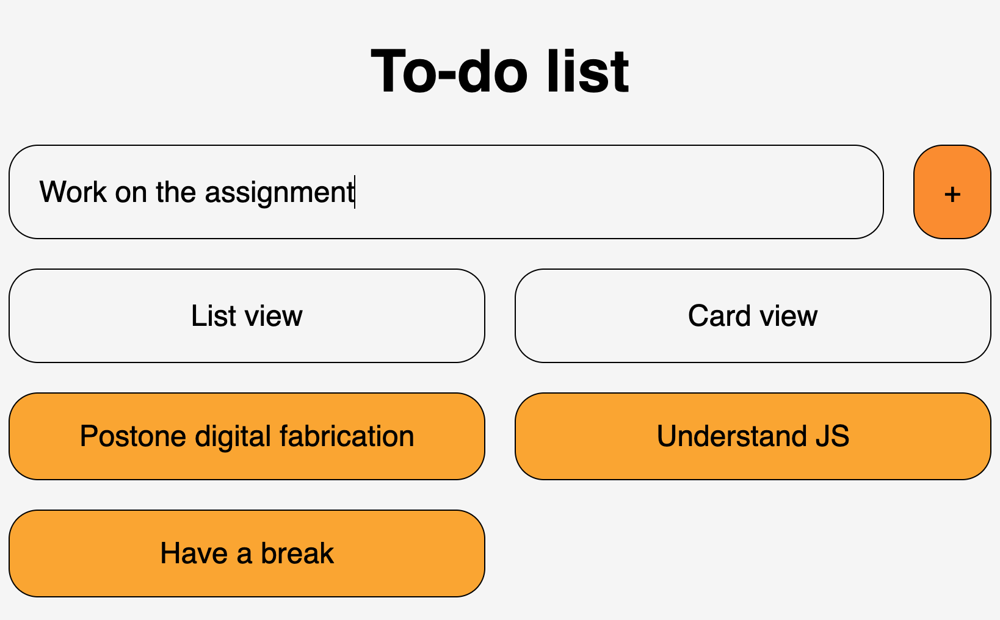

# Lesson 03

## Goal

Starting from the concept of a pinboard, implement a web page that:

- is responsive (properly layout for smartphone, tablet, and desktop)
- allows to add new elements to the list
- allows the switch between two views (at least)

## Project description

Add new to-dos to the list using the input field and the "+" button.

The view of the list can be changed between "list" and "card" using the dedicated buttons.

## Schreenshots

