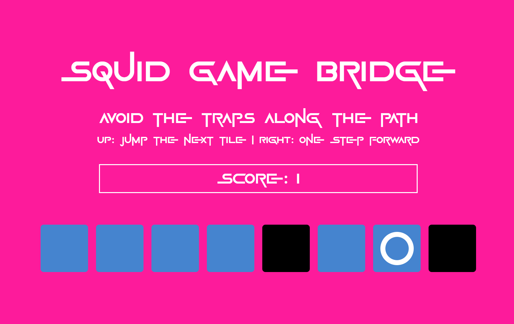
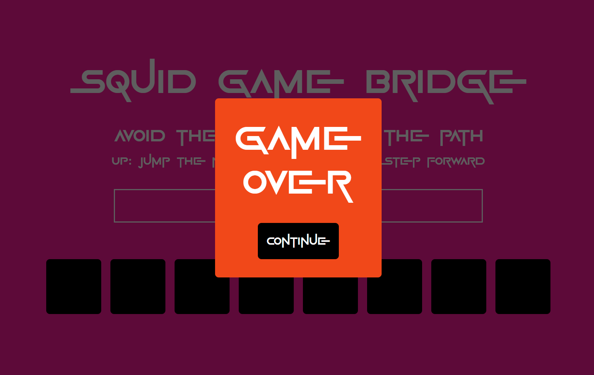
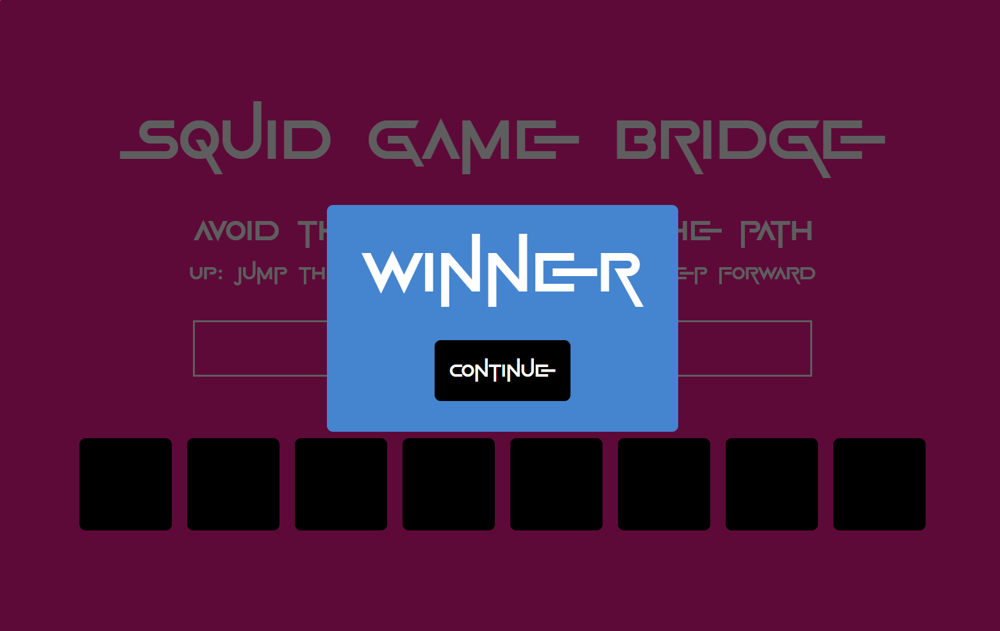
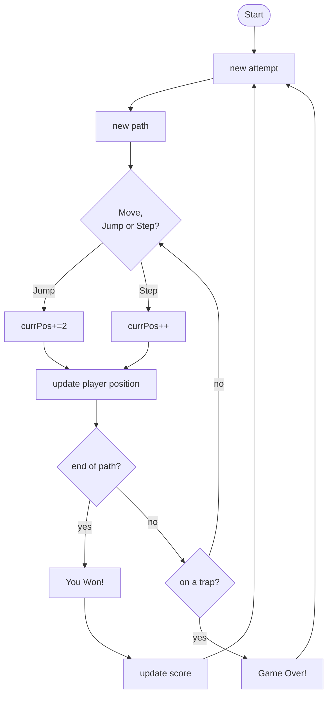

# Squid Game Bridge

## Brief

Choose a “mini-game” to rebuild with HTML, CSS and JavaScript. The requirements are:

- The webpage should be responsive
- Choose an avatar at the beginning of the game
- Keep track of the score of the player
- Use the keyboard to control the game (indicate what are the controls in the page). You can also use buttons (mouse), but also keyboard.
- Use some multimedia files (audio, video, …)
- Implement an “automatic restart” in the game (that is not done via the refresh of the page)

## Project description

The Squid Game Bridge mini-game is inspired to the Squid Game South Korean television series written by Hwang Dong-hyuk for Netflix. In the series the players are faced with numerous challenges, and one of them was to traverse a suspended made out of glass tiles. Some of the glass tiles were solid and could carry the weight of the players, others not, and would brake under the weight of the player, ending its game. It wasn't impossible knowing witch one were solid or not.

In this project, the player can move forward on a series of tiles, by pressing the right arrow on the keyboard, resulting in moving to the next tile, or the up arrow key, jumping over the next tile and landing on the one after it.

The player doesn't know if the next tile is solid or not.

If the player reaches the end of the bridge, the score count will increase by one, and it will restart at the beginning of the bridge to play again.

If it steps on a faulty glass tile, the attempt is over, and it will start from the beginning of the bridge for the next attempt.

## Screenshots

## Flowchart

## Function list

### document.addEventListener('keydown')

It checks for key pressed and if a key is pressed, the switch case does the following:

#### ArrowUp

Jump, postion of the player + 2 (currPos+=2), and call the function updatePlayerPosition()

#### ArrowRight

Step, postion of the player + 1 (currPos++), and call the function updatePlayerPosition()

---
### buttonCloseBanner.addEventListener('click')

It removes all the classes from the banner container, and the banner will have the default display:none propery and disappear from the interface

---
### newAttempt()

**Parameters** none

**Return** none

It moves the player back at the beginning of the bridge (currPos = -1)

---
### newPath()

**Parameters** none

**Return** none

It generates a new trap sequence by updating the array trapsSequence[] using the Math.random() method to generate a random value between 0 and 1 and doing a comparison right away (Math.random() < 0.5) to assign a true or false value to the current element of the trapsSequence[] array.

Once every value of the array has been updated, all the li elements are deleted from the ul path container

Using a for loop, new li elements with the dataset "traps" (true or false from the traspSequence[i]) and "id" (i of the for loop used as id) are appended as a child to the ul container.

---
### updatePlayerPosition()

**Parameters** none

**Return** none

It goes trough all the li elements with the method .forEach(), and if the dataset id corresponds to the player position, the class 'player' and 'active' are added to the current li element, else the class 'player' is removed.

The class 'active' in css does change the background of the tile to blue, and the class 'player' add the player icon (a circle in this case) as a background image to the tile.

---
### checkEndOfPath()

**Parameters** none

**Return** none

It checks if the player reached the end of the bridge or not, by comparing its current position against the length of the bridge itself (currPos < PATH_LENGTH).

If the player didn't reach the end of the bridge, the function to check the tile for traps is called, checkForTraps().

In case the player reached the end of the bridge, the audio file for the winning sound is player and the banner with the text "Winner" is displayed. The scores will be update and a new attempt will start.

---
### checkForTraps()

**Parameters** none

**Return** none

It checks if the value of the array trapdSequence[] at the currPos (current position of the player) is a trap (true). If it does, the mp3 file for the game over is played and the popup banner with the message "Game Over" is displayed. The game then starts with a new attempt, by calling the functio newAttempt().

Else, if it is not a trap, nothing happens, and the game waits for the user pressing a new key of the keyboard.

---
### popupOutcomeBanner(message, result)

**Parameters**

`message` (String) message to be displayed in the popup banner

`result` (String) "fail" or "win", classes used to change the css background of the popup banner (orange or blue)

**Return** none

---
### updateScore()

**Parameters** none

**Return** none

Update the score adding 1 to it. Update the span element with the new score.