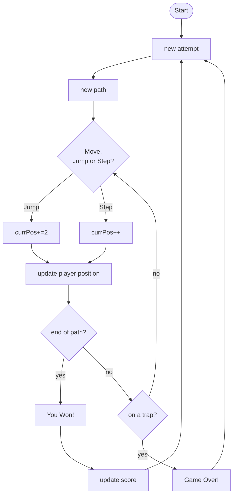

# Squid Game Bridge

## Brief

Create a Squid Game style 

## Project description

## Flowchart

```mermaid
flowchart TD
    n1["Start"] --> n7["new attempt"]
    n2["Move,<br>Jump or Step?"] -- Jump --> n3["currPos+=2"]
    n2 -- Step --> n4["currPos++"]
    n9["Game Over!"] --> n7
    n8["on a trap?"] -- yes --> n9
    n5["end of path?"] -- yes --> n10["You Won!"]
    n10 --> n11["update score"]
    n11 --> n7
    n12["new path"] --> n2
    n7 --> n12
    n3 --> n14["update player position"]
    n4 --> n14
    n14 --> n5
    n8 -- no --> n2
    n5 -- no --> n8
    n1@{ shape: terminal}
    n2@{ shape: decision}
    n8@{ shape: decision}
    n5@{ shape: decision}
```

## Function list
